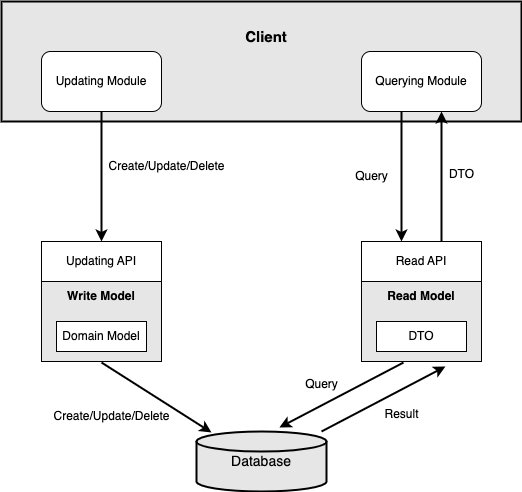

<p align="center">
  <a href="http://nestjs.com/" target="blank"></a>
  <a>
</p>
<p align="center">
  <a></a>
  <a></a>
  <a></a>
</p>


# NestJS, CQRS, Typescript, PostgreSQL, Docker, Serverless Framework, AWS Lambda, RDS, and CloudFormation

Basic NestJS application using CQRS which runs as local app, local cloud with Lambda using Serverless Framework and also connects to AWS RDS. 

## Architecture

<p align="center">
  
</p>

CQRS design pattern in DDD with [Nest](https://github.com/nestjs/nest), PostgreSQL, and Docker for local run and Lambda and RDS for cloud.

## Stack

- NestJS with CQRS design pattern
- Typescript
- PostgreSQL
- Docker
- AWS Lambda function behind AWS API Gateway. Single lambda serves entire API via proxy+.
- Serverless Framework
- CloudFormation
- AWS RDS

## Instructions

### Run as a local Nest app with local db

```
# Download or pull Postgres Docker image and start the container
docker pull postgres
docker run --name <CONTAINER_NAME> -e POSTGRES_PASSWORD=<PASSWORD> -p 5432:5432 -d postgres
```

```
# Interact with Postgres in Terminal

docker exec -it <CONTAINER_NAME> psql -U <USERNAME>
CREATE DATABASE <DATABASE_NAME>;

CREATE TABLE UserTable(
 Id SERIAL PRIMARY KEY NOT NULL,
 Name Text NULL,
 Age INT NULL
)

INSERT INTO UserTable(Name, Age) VALUES('Bob', 29);
select * from UserTable;
```

Run `nest start`

List all Users
```
curl -H "Content-Type:application/json" http://localhost:3000/user/all
```

Create a User
```
curl -X POST -H "Content-Type:application/json" http://localhost:3000/user/add --data '{"name": "Bob", "age": 29}'
```

### Run as a local cloud lambda application with local db
  
Use command `sls offline start` and follow the generated urls to communicate with the app, e.g. open `http://localhost:3000/dev/user/all` to get the list of users. 

### Run as a local cloud lambda application with RDS on cloud

Use CloudFormation to create PostgreSQL RDS on AWS:

`aws cloudformation deploy --stack-name  users-api-db --template-file rds.yaml`

To create the RDS in an EC2, use the following command instead:

`aws cloudformation deploy --stack-name  users-api-db --template-file ec2_rds.yaml`

This will allow SSH inbound traffic if you want to connect to EC2, enable PostgreSQL and connect to the databse. 

Use command `sls offline start` and follow the generated urls to communicate with the app. You may allow HTTP in inbound secrurity group to (unsecurely) connect to database for testing this scenario. 

